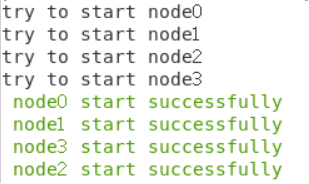

# BLOCKCHAIN

## 0.环境要求

- linux 系统（笔者选用的是 centos7）
- 配置文件夹的 gradle 6.8（解压+环境变量设置https://blog.csdn.net/wenwujava/article/details/79499465）
- java 1.8+即可
- FISCO_BCOS

​	

下面的运行请在 su 下面做（进入 root 管理员权限）

- 如若需要修改前后端，则在修改 java 文件后，直接重复步骤 2、3 进行编译运行即可


## 1.首先按照教程运行节点

- 按照[官方教程]( https://fisco-bcos-documentation.readthedocs.io/zh_CN/latest/docs/tutorial/sdk_application.html )进行配置后：

```
cd fisco\nodes\127.0.0.1
bash start_all.sh
```



## 2.编译项目

```bash
cd fisco/asset-app
./gradlew build
```


## 3.运行代码

- 部署运行
- 合约已经内置于控制台中，位于控制台目录下 fisco\console\contracts\solidity
- 在控制台输入以下指令，部署成功则返回合约地址

```bash
cd fisco/asset-app/dist
bash asset_run.sh deploy
```

