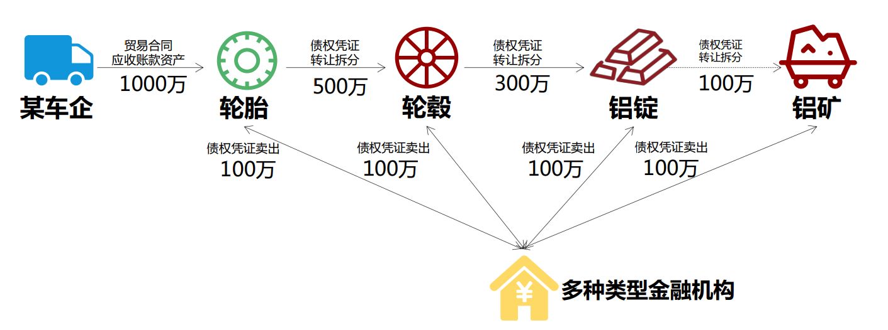

## 区块链原理与技术期末大项目实验报告

[TOC]


| 课程名称 | 区块链原理与技术     | 任课老师 | 黄华威                       |
| -------- | -------------------- | -------- | ---------------------------- |
| 年级     | 2018级               | 专业     | 软件工程                     |
| 小组     | Group 6              | 大作业   | 基于区块链的供应链金融平台   |
| 组员     | 黄进、胡梓渊、喻勇强 | 学号     | 18342029、18342026、18342123 |
| 开始日期 | 2021.1.1             | 完成日期 | 2021.1.25                    |

## 一、项目简介

### 1. 简单介绍

#### ① 项目背景

​       传统的供应链金融由于交易信息不透明，上游核心企业的信用无法在供应链中传递，导致下游企业向银行等金融机构贷款融资难。而将区块链和供应链金融结合，就能较好解决这个问题。

​       项目在 FISCO-BCOS 区块链系统上设计基于区块链的供应链智能合约。


#### ② 场景介绍



##### 传统供应链金融

​         某车企（宝马）因为其造车技术特别牛，消费者口碑好，所以其在同行业中占据绝对优势地位。因此，在金融机构（银行）对该车企的信用评级将很高，认为他有很大的风险承担的能力。在某次交易中，该车企从轮胎公司购买了一批轮胎，但由于资金暂时短缺向轮胎公司签订了1000万的应收账款单据，承诺1年后归还轮胎公司1000万。这个过程可以拉上金融机构例如银行来对这笔交易作见证，确认这笔交易的真实性。在接下里的几个月里，轮胎公司因为资金短缺需要融资，这个时候它可以凭借跟某车企签订的应收账款单据向金融结构借款，金融机构认可该车企（核心企业）的还款能力，因此愿意借款给轮胎公司。但是，这样的信任关系并不会往下游传递。在某个交易中，轮胎公司从轮毂公司购买了一批轮毂，但由于租金暂时短缺向轮胎公司签订了500万的应收账款单据，承诺1年后归还轮胎公司500万。当轮毂公司想利用这个应收账款单据向金融机构借款融资的时候，金融机构因为不认可轮胎公司的还款能力，需要对轮胎公司进行详细的信用分析以评估其还款能力同时验证应收账款单据的真实性，才能决定是否借款给轮毂公司。这个过程将增加很多经济成本，而这个问题主要是由于该车企的信用无法在整个供应链中传递以及交易信息不透明化所导致的。

##### 区块链+供应链金融

​        将供应链上的每一笔交易和应收账款单据上链，同时引入第三方可信机构来确认这些信息的交易，例如银行，物流公司等，确保交易和单据的真实性。同时，支持应收账款的转让，融资，清算等，让核心企业的信用可以传递到供应链的下游企业，减小中小企业的融资难度。


#### 实验目标

- 基于区块链、智能合约等，实现基于区块链的供应链金融平台。  

- 基于已有的开源区块链系统FISCO-BCOS（https://github.com/FISCO-BCOS/FISCO-BCOS），以
  联盟链为主，开发基于区块链或区块链智能合约的供应链金融平台，实现**供应链应收账款资产的溯源、流转**。  
  
  

#### 基本功能

1. 注册账户
   - 输入账户名和资产金额进行注册
2. 查询账户信息
   - 可根据账户名查询一个账户是否存在，它的资产金额是多少
3. 查询交易信息
   - 可以根据交易编号ID查询一笔交易是否存在，它的交易金额和未结清金额是多少，债权人和借债
     人是谁  
4. 资产转移
   - 将金额从一个账户转移到另一个  

##### 四个交易功能

1. 功能一：实现采购商品—签发应收账款 交易上链。例如车企从轮胎公司购买一批轮胎并签订应收账
   款单据。
2. 功能二：实现应收账款的转让上链，轮胎公司从轮毂公司购买一笔轮毂，便将于车企的应收账款单
   据部分转让给轮毂公司。轮毂公司可以利用这个新的单据去融资或者要求车企到期时归还钱款。
3. 功能三：利用应收账款向银行融资上链，供应链上所有可以利用应收账款单据向银行申请融资。
4. 功能四：应收账款支付结算上链，应收账款单据到期时核心企业向下游企业支付相应的欠款。  


#### 项目设计

(项目结构)


(数据结构)


## 二、实验环境

硬件信息：virtual box虚拟机（内存5G、磁盘20G）

操作系统：Centos 7

编程语言：Java、solidity、Golang、GoTTY


#### 环境配置安装

##### 私有链搭建

- 具体请参看 `stage_1` 的《前期热身报告》


##### Java

下载 `JDK`：

- 进入 Oracle 官方网站(https://www.oracle.com/java/technologies/javase/javase-jdk8-downloads.html) 下载合适的 JDK 版本，以 jdk-8u151-linux-x64.tar.gz 为例。或者使用命令行方式

```shell
# centos 系统安装 java
sudo yum install -y java java-devel
```

- 创建目录

```
mkdir /usr/java
cd /usr/java
```

- 解压JDK

```
tar -zxvf jdk-8u151-linux-x64.tar.gz
```

- 配置环境变量

```
vim /etc/profile
```

在 profile 文件中添加如下内容并保存(先按ESC，然后输入“:wq”)：

```
#set java environment
JAVA_HOME=/usr/java/jdk1.8.0_191    
JRE_HOME=/usr/java/jdk1.8.0_191/jre     
CLASS_PATH=.:$JAVA_HOME/lib/dt.jar:$JAVA_HOME/lib/tools.jar:$JRE_HOME/lib
PATH=$PATH:$JAVA_HOME/bin:$JRE_HOME/bin
export JAVA_HOME JRE_HOME CLASS_PATH PATH
```

执行配置

```
source /etc/profile
```

- 测试

```
java -version
```


##### solidity

笔者选择的是在 vscode 安装 solidity 插件，进行合约代码文件 sol 的编写


##### Golang

- 安装：

```
sudo yum install golang
```

- 测试安装

```
go version
```

- 创建工作空间

```
mkdir $HOME/gowork
```

- 配置环境变量

```
vim /etc/profile
```

 在 ~/.profile 文件中添加:

```
export GOPATH=$HOME/gowork
export PATH=$PATH:$GOPATH/bin
```

执行配置

```
 source $HOME/.profile
```

##### GoTTY

- 安装(需要安装Golang)：

```
go get github.com/yudai/gotty
```

- 配置环境

```
vim /etc/profile
```

 在 ~/.profile 文件中添加:

```
export PATH="$PATH:$GOBIN"
```

执行配置

```
source ~/.profile
```


## 三、实验测试

#### 基本功能测试

1.账户注册


2.查询账户信息


3.查询交易信息


4.资产转移


#### 场景测试


## 四、实验心得


## 五、参考文档

 - [FISCO BCOS 安装 官方文档](https://fisco-bcos-documentation.readthedocs.io/zh_CN/latest/docs/installation.html)
 - [群组新增节点部分](https://fisco-bcos-documentation.readthedocs.io/zh_CN/latest/docs/manual/build_chain.html#id16)
 - [FISCO BCOS API](https://fisco-bcos-documentation.readthedocs.io/zh_CN/latest/docs/api.html#getblockbynumber)