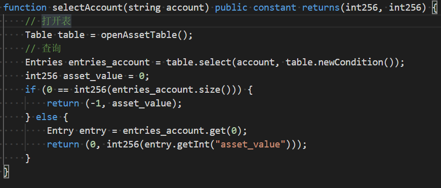
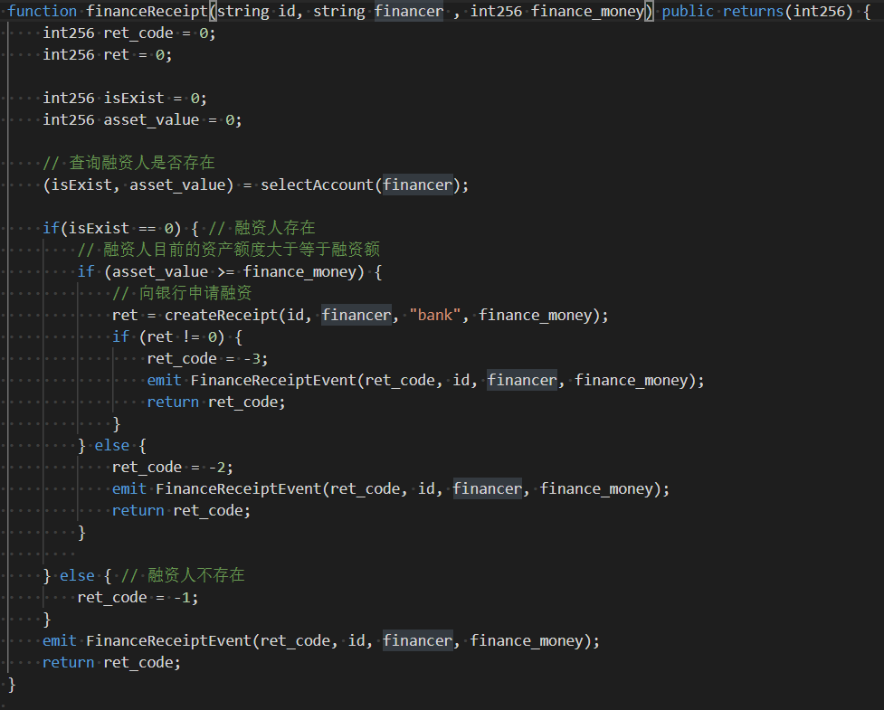

# 区块链原理与技术期末大项目实验报告

[TOC]

| 课程名称 | 区块链原理与技术     | 任课老师 | 黄华威                       |
| -------- | -------------------- | -------- | ---------------------------- |
| 年级     | 2018级               | 专业     | 软件工程                     |
| 小组     | Group 6              | 大作业   | 基于区块链的供应链金融平台   |
| 组员     | 黄进、胡梓渊、喻勇强 | 学号     | 18342029、18342026、18342123 |
| 开始日期 | 2021.1.1             | 完成日期 | 2021.1.25                    |

## 一、项目简介

### 1. 简单介绍

#### ① 项目背景

​       传统的供应链金融由于交易信息不透明，上游核心企业的信用无法在供应链中传递，导致下游企业向银行等金融机构贷款融资难。

​        而将区块链和供应链金融结合，就能较好解决这个问题。在区块链+供应链中，区块链会将供应链上的每一笔交易和应收账款单据上链，并引入第三方可信机构来确认这些信息的交易。此外区块链也会支持应收账款的转让，融资，清算等，让核心企业的信用可以传递到供应链的下游企业，减小中小企业的融资难度。  

​       项目在 FISCO-BCOS 区块链系统上设计基于区块链的供应链智能合约（链端），并基于JAVA完成相应的前后端应用开发。

#### ② 场景介绍（流程图）


##### 传统供应链金融

​         某车企（宝马）因为其造车技术特别牛，消费者口碑好，所以其在同行业中占据绝对优势地位。因此，在金融机构（银行）对该车企的信用评级将很高，认为他有很大的风险承担的能力。在某次交易中，该车企从轮胎公司购买了一批轮胎，但由于资金暂时短缺向轮胎公司签订了1000万的应收账款单据，承诺1年后归还轮胎公司1000万。这个过程可以拉上金融机构例如银行来对这笔交易作见证，确认这笔交易的真实性。在接下里的几个月里，轮胎公司因为资金短缺需要融资，这个时候它可以凭借跟某车企签订的应收账款单据向金融结构借款，金融机构认可该车企（核心企业）的还款能力，因此愿意借款给轮胎公司。但是，这样的信任关系并不会往下游传递。在某个交易中，轮胎公司从轮毂公司购买了一批轮毂，但由于租金暂时短缺向轮胎公司签订了500万的应收账款单据，承诺1年后归还轮胎公司500万。当轮毂公司想利用这个应收账款单据向金融机构借款融资的时候，金融机构因为不认可轮胎公司的还款能力，需要对轮胎公司进行详细的信用分析以评估其还款能力同时验证应收账款单据的真实性，才能决定是否借款给轮毂公司。这个过程将增加很多经济成本，而这个问题主要是由于该车企的信用无法在整个供应链中传递以及交易信息不透明化所导致的。

##### 区块链+供应链金融

​        将供应链上的每一笔交易和应收账款单据上链，同时引入第三方可信机构来确认这些信息的交易，例如银行，物流公司等，确保交易和单据的真实性。同时，支持应收账款的转让，融资，清算等，让核心企业的信用可以传递到供应链的下游企业，减小中小企业的融资难度。


### 2. 实验目标

- 基于区块链、智能合约等，实现基于区块链的供应链金融平台。  

- 基于已有的开源区块链系统FISCO-BCOS（https://github.com/FISCO-BCOS/FISCO-BCOS），以
  联盟链为主，开发基于区块链或区块链智能合约的供应链金融平台，实现**供应链应收账款资产的溯源、流转**。  
  
  
  
  

### 3. 实现功能

#### ① 四个核心交易功能

1. 功能一：签发应收账款交易上链（添加交易）

   - 实现**采购商品—签发应收账款 交易上链**。例如车企从轮胎公司购买一批轮胎并签订应收账款单据。

2. 功能二：应收账款的转让上链（拆分交易）

   - 实现**应收账款的转让上链**，轮胎公司从轮毂公司购买一笔轮毂，便将于车企的应收账款单据部分转让给轮毂公司。轮毂公司可以利用这个新的单据去融资或者要求车企到期时归还钱款。

3. 功能三：利用应收账款向银行融资上链（向银行贷款融资）

   - 利用**应收账款向银行融资上链**，供应链上所有可以利用应收账款单据向银行申请融资。

4. 功能四：应收账款支付结算上链（支付结算交易）

   - **应收账款支付结算上链**，应收账款单据到期时核心企业向下游企业支付相应的欠款。  

#### ② 六个额外服务功能

1. 注册账户

   - 输入账户名，密码和资产金额进行注册

2. 登录账户

   - 输入账户名和密码进行登录

3. 查询账户信息

   - 可根据账户名查询一个账户是否存在，它的资产金额是多少

4. 查询交易信息

   - 可以根据交易编号ID查询一笔交易是否存在，它的交易金额和未结清金额是多少，债权人和借债人是谁  

5. 退出登录

6. 退出系统

   

- 根据提供的供应链场景，基于 FISCO-BCOS 设计相关的智能合约并详细解释智能合约是如何解决提出的问题，即介绍如何设计智能合约，以方便实现四个功能，相当于对设计的 Asset.sol 合约文件进行源码解读  


## 二、项目设计

### 0. 项目文件结构（asset-app）

```
|-- build.gradle // gradle 配置文件
|-- gradle
| |-- wrapper
| |--|-- gradle-wrapper.jar
| |--|-- gradle-wrapper.properties // wrapper 所使用的配置信息，比如 gradle 的版本等信息
|-- gradlew // Linux 或者 Unix 下用于执行 wrapper 命令的 Shell 脚本
|-- gradlew.bat // Windows 下用于执行 wrapper 命令的批处理脚本
|-- src
| |-- main
| | |-- java
| | |--|-- org
| | |--|--|-- fisco
| | |--|--|--|-- bcos
| | |--|--|--|--|-- asset
| | |--|--|--|--|--|-- client // 前后端代码文件
| | |--|--|--|--|--|--|-- AssetClient.java
| | |--|--|--|--|--|--|-- AssetBackend.java
| | |--|--|--|--|--|-- contract // Java 合约类
| | |--|--|--|--|--|--|-- Asset.java
| |-- test
| |--|-- resources 
| |-- applicationContext.xml 
| |-- contract.properties 
| |-- log4j.properties 
| |--|-- contract 
| |--|--|-- Asset.sol
| |--|--|-- Table.sol
|-- tool
|-- asset_run.sh // 项目运行脚本
```


### 1. 链端（Asset.sol，Table.sol）

#### ① 数据库操作

##### 1）CRUD 接口

- `Asset.sol`合约的实现需要引入 FISCO BCOS 提供的一个系统合约接口文件 `Table.sol` ，该系统合约文件中的接口由 FISCO BCOS 底层实现。当业务合约需要操作 CRUD 接口时，均需要引入该接口合约文件。
- 可以实现合约逻辑与数据的分离  
- 比如以下 `api`，用于创建、打开表；进行查询、插入、更新和删除


##### 2）构建表

- 针对本应用需要设计一个存储资产管理的表`t_asset`，该表字段如下：

  - account: 主键，资产账户 (string类型)
  - asset_value: 资产金额 (int256类型)

  其中account是主键，即操作`t_asset`表时需要传入的字段，区块链根据该主键字段查询表中匹配的记录。

- 除此之外还需要设计一个存储交易记录的表`t_receipt`，该表字段如下：

  - id：主键，标识交易的唯一 ID (string类型)
  - borrower：借债人 (string类型)
  - debtee：债权人 (string类型)
  - money：交易债务金额 (int256类型)
  - status：未结清金额 (int256类型)

- 根据设计的表结构建表


- 打开表


#### ② 基础功能

##### 1）账户注册 (register)

- 输入账户名和资产金额进行注册

```
     /*
    描述 : 资产注册
    参数 ： 
            account :      资产账户
            asset_value  : 资产金额
    返回值：
            0  资产注册成功
            -1 资产账户已存在
            -2 其他错误
    */
```


##### 2）查询账户信息 (selectAccount)

- 可以根据账户名查询一个账户是否存在，它的资产金额是多少

```
/*
    描述 : 根据资产账户查询资产金额
    参数 ： 
            account : 资产账户
    返回值：
            参数一： 成功返回 0, 账户不存在返回 -1
            参数二： 第一个参数为 0 时有效，代表资产金额
*/
```



##### 3）查询交易信息 (selectReceipt)

- 可以根据交易编号 ID 查询一笔交易是否存在，它的交易金额和未结清金额是多少，债权人和借债人是谁

```
/*
    描述 : 根据交易 ID 查询交易信息
    参数 ： 
            id : 交易编号
    返回值：
            参数一： 若成功返回 0
            参数二： 若成功数组首个元素为初始交易金额, 第二个为未结清金额
            参数三： 若成功则第一个元素为债权人, 第二个为借债人
    */
```


##### 4）资产转移 (transfer)

- 将金额从一个账户转移到另一个

```
/*
    描述 : 资产转移
    参数 ： 
            from_account : 转移资产账户
            to_account ：  接收资产账户
            asset_value ： 转移金额
    返回值：
            0  资产转移成功
            -1 转移资产账户不存在
            -2 接收资产账户不存在
            -3 金额不足 
            -4 金额溢出
            -5 其他错误
    */
```


#### ③ 交易功能（以下行为会记录在链上）

##### 1）签发应收账款交易上链（添加交易 createReceipt）

- 通过调用资产转移函数 `transfer` 实现创建新交易功能  
- 只有上游企业（资产额度足够大）才能发起交易，上游企业与下游企业进行交易，两者之间签订了一笔交易

```
/*
    描述 : 签发应收账款交易上链（添加交易）
    参数 ： 
            id :       交易编号
            borrower : 借债人
            debtee :   债权人
            transaction_money:     初始交易金额
    返回值：
            0  交易添加成功
            -1 交易已存在
            -2 资产转移错误
            -3 借债人资产额度不够
            -4 其他错误
    */
```


##### 2）应收账款的转让上链（拆分交易 divideRecipt）

- 假设一个用户是一笔交易的债权人，现在他想转让到另一笔向别的用户借债的新交易中，可以将不超过原交易未结清金额的额度转移给另外一个用户
- 通过转让原交易借债人的应收账款给新交易的债权人，实现交易转移，新债权人会从该用户那获得同等额度的资产  
- debtee 把 borrower 借的债转让给 newDebtee，debtee 资产额度转移给 newDebtee，分为两步

  1. borrower 还债给 debtee `(repayReceipt)`
  2. borrower 向 newDebtee 借债 `(createReceipt)`

```
/*
    描述 ： 应收账款的转让上链（拆分交易）
    参数 ：
            original_id:  需要转让的交易 ID
            new_id:       新创建的交易 ID
            newDebtee:    新创建交易的债权人
            divide_money:        交易拆分的金额
    返回值 :
             0 交易转让成功
            -1 转让的交易不存在
            -2 账户不存在
            -3 转让的金额大于原交易未结算的金额
            -4 资产返还错误
            -5 新交易创建不成功
    */
```


##### 3）利用应收账款向银行融资上链（融资 financeReceipt）

- 把应收账款转让给银行，从而从银行获得融资  
- 所有企业都可以使用自身的资产额度向银行请求融资，获得一笔不多于自身资产额度的金额。
- 在我们设计的智能合约中将这种行为视为该企业与银行之间创建了一笔交易 `(createReceipt)`，将企业的资产额度转移给银行  

```
/*
    描述 : 利用应收账款向银行融资上链（融资）
    参数 ： 
            id :           融资编号
            financer :     融资人
            finance_money: 金额
    返回值：
             0 融资成功
            -1 融资人不存在
            -2 融资额大于融资人目前的资产额度
            -3 其他错误
    */
```



##### 4）应收账款支付结算上链（结算交易 repayReceipt）

- 通过资产转移来移除借款人手中的应收账款，借债人和债权人资产额度变化结算的金额
- 在一笔交易中，作为借债人的企业可以通过还钱给债主来让交易中的未结清金额减少，并从债权人那返还等额的资产额度。当未结清金额为 0 时，该交易支付结算完毕

```
/*
    描述 : 应收账款支付结算上链（结算交易）
    参数 ： 
            id : 交易编号
            repay_money: 金额
    返回值：
             0 交易结算成功
            -1 交易不存在
            -2 还债金额大于借款
            -3 其他错误
            -4 资产返还错误
    */
```


### 2. 后端

- 代码文件路径：stage_3\blockchain_final\fisco\asset-app\src\main\java\org\fisco\bcos\asset\client 
- 或者 stage_3\部分代码文件\后端 的 `AssetBackend.java`，以及由 `Asset.sol` 转化而来的 `Asset.java`，即合约到 java 文件的一个转换

#### ① 关键代码

- 初始化服务

```java
 public void initialize() throws Exception {
    // init the Service
    @SuppressWarnings("resource")
    ApplicationContext context = new ClassPathXmlApplicationContext("classpath:applicationContext.xml");
    bcosSDK = context.getBean(BcosSDK.class);
    client = bcosSDK.getClient(1);
    cryptoKeyPair = client.getCryptoSuite().createKeyPair();
    client.getCryptoSuite().setCryptoKeyPair(cryptoKeyPair);
    logger.debug("Create client for group1, account address is " + cryptoKeyPair.getAddress());
  }
```

- 部署合约并记录地址

```java
public void deployAssetAndRecordAddr() {
    ……
      Asset asset = Asset.deploy(client, cryptoKeyPair);
      System.out.println("部署合约成功，合约地址: " + asset.getContractAddress());

      recordAssetAddr(asset.getContractAddress());
   ……
}
```

- 注册账户

```java
  public void registerAssetAccount(String assetAccount, BigInteger asset_value) {
   ……
      TransactionReceipt receipt = asset.register(assetAccount, asset_value);
      List<Asset.RegisterEventEventResponse> response = asset.getRegisterEventEvents(receipt);

      if (!response.isEmpty()) {
        if (response.get(0).ret.compareTo(new BigInteger("0")) == 0) {
          System.out.printf("注册账户成功，账户名为 %s，信用额度为 %s \n", assetAccount, asset_value);
        } else if (response.get(0).ret.compareTo(new BigInteger("-1")) == 0) {
          System.out.printf("注册账户失败，账户已存在\n");
        }
        else {
          System.out.printf("注册账户失败，其他错误\n");
        }
      } ……
  }
```

- 查询账户余额

```java
  public void queryAssetAmount(String assetAccount) {
    ……
      Tuple2<BigInteger, BigInteger> result = asset.selectAccount(assetAccount);

      if (result.getValue1().compareTo(new BigInteger("0")) == 0) {
        System.out.printf("账户 %s 的信用额度为：%s \n", assetAccount, result.getValue2());
      } else {
        System.out.printf("账户 %s 不存在\n", assetAccount);
      }
    } ……
  }
```

- 查询交易

```java
public void queryAssetTransaction(String t_id) {
 ……
    Tuple3<BigInteger, List<BigInteger>, List<String>> result = asset.selectReceipt(t_id);

    if (result.getValue1().compareTo(new BigInteger("0")) == 0) {
            String temp1 = new String(result.getValue3().get(0));
            String temp2 = new String(result.getValue3().get(1));
            System.out.printf("交易\n ID: " + t_id + "; 借债人: " + temp1 + "; 债权人: " + temp2 + "; 原始金额: "
                + result.getValue2().get(0) + "; 剩余待还: " + result.getValue2().get(1) + "\n");
    } else {
      System.out.printf("交易 %s 不存在\n", t_id);
    }
  } ……
}
```

- 资产转移

```java
public void transferAsset(String fromAssetAccount, String toAssetAccount, BigInteger asset_value) {
 ……
    TransactionReceipt receipt = asset.transfer(fromAssetAccount, toAssetAccount, asset_value);
    List<Asset.TransferEventEventResponse> response = asset.getTransferEventEvents(receipt);

    if (!response.isEmpty()) {
      if (response.get(0).ret.compareTo(new BigInteger("0")) == 0) {
        System.out.printf("资产转移成功，从 %s 转移到 %s %s 额度\n",
            fromAssetAccount, toAssetAccount, asset_value);
      } else {
        System.out.printf("资产转移失败，ret code : %s \n", response.get(0).ret.toString());
        System.out.printf("-1 转移资产账户存在\n-2 接收资产账户不存在\n-3 金额不足\n-4 金额溢出\n-5 其他错误");
      }
    } ……
}
```

- 添加交易(签发应收账款交易上链)

```java
public void createAssetTransaction(String t_id, String borrower, String debtee, BigInteger money) {
		……
			TransactionReceipt receipt = asset.createReceipt(t_id, borrower, debtee, money);
      List<CreateReceiptEventEventResponse> response = asset.getCreateReceiptEventEvents(receipt);
      
			if (!response.isEmpty()) {
				if (response.get(0).ret.compareTo(new BigInteger("0")) == 0) {
					System.out.printf("添加交易成功! ID : " + t_id + " 借债人: " + borrower + " 债权人: " + debtee + " 额度: " + money +"\n");
				} else {
					System.out.printf("添加交易失败, ret code: %s \n", response.get(0).ret.toString());
          System.out.printf("-1 交易已存在\n-2 资产转移错误\n-3 借债人资产额度不够\n-4 其他错误");
				}
			} ……
  }
```

- 拆分交易(应收账款的转让上链)

```java
public void divideAssetTransaction(String original_id, String new_id, String newDebtee, BigInteger divide_money) {
 ……
    TransactionReceipt receipt = asset.divideReceipt(original_id, new_id, newDebtee, divide_money);
    List<DivideReceiptEventEventResponse> response = asset.getDivideReceiptEventEvents(receipt);

    if (!response.isEmpty()) {
      if (response.get(0).ret.compareTo(new BigInteger("0")) == 0) {
        System.out.printf("拆分交易成功! original_id: "+ original_id + " new_id: " + new_id + " 新债权人: " 
                          + newDebtee + " 拆分金额: " + divide_money +"\n");
      } else {
        System.out.printf("拆分交易失败, ret code : %s \n", response.get(0).ret.toString());
        System.out.printf("-1 转让的交易不存在\n-2 账户不存在\n-3 转让的金额大于原交易未结算的金额\n-4 资产返还错误\n-5 新交易创建不成功");
      }
    } ……
}
```

- 融资(利用应收账款向银行融资上链)

```java
public void financeAssetTransaction(String f_id, String financer, BigInteger finance_money) {
    ……
      TransactionReceipt receipt = asset.financeReceipt(f_id, financer,  finance_money);
      List<FinanceReceiptEventEventResponse> response = asset.getFinanceReceiptEventEvents(receipt);
    
      if (!response.isEmpty()) {
        if (response.get(0).ret.compareTo(new BigInteger("0")) == 0) {
          System.out.printf("融资成功! ID : " + f_id + " 融资人: " + financer + " 额度: " + finance_money +"\n");
        } else {
          System.out.printf("融资失败, ret code: %s \n", response.get(0).ret.toString());
          System.out.printf("-1 融资人不存在\n-2 融资额大于融资人目前的资产额度\n-3 其他错误");
        }
      } ……
  }
```

结算交易(应收账款支付结算上链)

```java
public void repayAssetTransaction(String t_id, BigInteger repay_money) {
		……

			TransactionReceipt receipt = asset.repayReceipt(t_id, repay_money);
			List<RepayReceiptEventEventResponse> response = asset.getRepayReceiptEventEvents(receipt);
			
			if (!response.isEmpty()) {
				if (response.get(0).ret.compareTo(new BigInteger("0")) == 0) {
					System.out.printf("成功支付结算交易. ID: "+ t_id + " 额度 :" + repay_money + "\n" );
				} else {
          System.out.printf("支付结算失败, ret code: %s\n", response.get(0).ret.toString());
          System.out.printf("-1 交易不存在\n-2 还债金额大于借债\n-3 其他错误\n-4 资产返还错误");
				}
			} ……
  }
```


### 3. 前端

- 代码文件路径：stage_3\blockchain_final\fisco\asset-app\src\main\java\org\fisco\bcos\asset\client 
- 或者 stage_3\部分代码文件\前端 的 `AssetClient.java`

#### ① 界面设计

- 用户可选择登陆已有账户或注册新账户，随后可以进行功能的使用


#### ② 关键代码

- 运行前端用户交互界面

```java
public static void main(String[] args) throws Exception {
  ……
  }
```

- 用户注册登录功能的实现

```java
public boolean login(AssetBackend backend)
    {
        read_file();
        int select;
        String name, password, password_again;
        System.out.print("请输入数字：1）登录已有账户 2）注册新账户\n");
        select = scanner.nextInt();

        if (select == 1) {
            name = (String)scanner.nextLine();
            System.out.print("请输入用户名: ");
            name = (String)scanner.nextLine();
            System.out.print("用户" + name + ",请输入密码: ");
            password = (String)scanner.nextLine();
            if (passwordMap.get(name) != null && passwordMap.get(name).compareTo(password) == 0) {
                current = name;
                System.out.print("登录成功\n");
                status = true;
                return false;
            }
            else {
                System.out.print("登录失败\n");
                status = false;
                return false;
            }
        }

        else if (select == 2) {
            name = (String)scanner.nextLine();
            System.out.print("请输入注册的用户名: ");
            name = (String)scanner.nextLine();
            if (passwordMap.get(name) != null) {
                System.out.print("用户名已经被使用过\n");
                status = false;
                return false;
            }
            else {
                System.out.print("用户" + name + ",请输入密码: ");
                password = (String)scanner.nextLine();
                System.out.print("请再一次输入密码: ");
                password_again = (String)scanner.nextLine();
                if (passwordMap.get(name) == null && password.compareTo(password_again) == 0) {
                    passwordMap.put(name, password);
                    System.out.print("请输入资产额度: ");
                    String asset_value = (String)scanner.nextLine();
                    backend.registerAssetAccount(name, new BigInteger(asset_value));
                    write_file();
                    read_file();
                    System.out.print("注册成功\n");
                    status = false;
                    return false;
                }
                else {
                    System.out.print("输入错误\n");
                    status = false;
                    return false;
                }
            }
        }
        return false;
    }
```


## 三、实验环境

硬件信息：virtual box虚拟机（内存5G、磁盘20G）

操作系统：Centos 7

编程语言：Java、solidity、Golang

实用工具：GoTTY


### 1. 环境配置安装

#### ① 私有链搭建

- 具体请参看 `stage_1` 的《前期热身报告》


#### ② Java

下载 `JDK`：

- 进入 Oracle 官方网站(https://www.oracle.com/java/technologies/javase/javase-jdk8-downloads.html) 下载合适的 JDK 版本，以 jdk-8u151-linux-x64.tar.gz 为例。或者使用命令行方式

```shell
# centos 系统安装 java
sudo yum install -y java java-devel
```

- 创建目录

```
mkdir /usr/java
cd /usr/java
```

- 解压JDK

```
tar -zxvf jdk-8u151-linux-x64.tar.gz
```

- 配置环境变量

```
vim /etc/profile
```

在 profile 文件中添加如下内容并保存(先按ESC，然后输入“:wq”)：

```
#set java environment
JAVA_HOME=/usr/java/jdk1.8.0_191    
JRE_HOME=/usr/java/jdk1.8.0_191/jre     
CLASS_PATH=.:$JAVA_HOME/lib/dt.jar:$JAVA_HOME/lib/tools.jar:$JRE_HOME/lib
PATH=$PATH:$JAVA_HOME/bin:$JRE_HOME/bin
export JAVA_HOME JRE_HOME CLASS_PATH PATH
```

执行配置

```
source /etc/profile
```

- 测试

```
java -version
```


#### ③ Solidity

笔者选择的是在 vscode 安装 solidity 插件，进行合约代码文件 sol 的编写


#### ④ Golang

- 安装：

```
sudo yum install golang
```

- 测试安装

```
go version
```

- 创建工作空间

```
mkdir $HOME/gowork
```

- 配置环境变量

```
vim /etc/profile
```

 在 ~/.profile 文件中添加:

```
export GOPATH=$HOME/gowork
export PATH=$PATH:$GOPATH/bin
```

执行配置

```
 source $HOME/.profile
```


#### ⑤ GoTTY

- 安装(需要安装Golang)：

```
go get github.com/yudai/gotty
```

- 配置环境

```
vim /etc/profile
```

 在 ~/.profile 文件中添加:

```
export PATH="$PATH:$GOBIN"
```

执行配置

```
source ~/.profile
```


## 四、实验测试

> 通过车企`tql`、轮胎厂`hjdl`、轮毂厂`hdl`和银行`bank`的金融交易，来进行实验项目的演示视频可见`大作业实验项目演示视频_车企tql_轮胎厂hjdl_轮毂厂hdl.mp4`。

### 1. 场景示例展示

​	在区块链金融系统中，除了登录、注册、查询和退出等服务功能外，主要有四个核心的交易功能， 分别是添加交易上链、 交易转让上链、 融资上链和支付结算上链。  我们的实验项目界面展示如下：

​	

​	

​	首先，我们不妨引入一个场景示例，假设区块链金融系统中的对象一共有四个，分别是上游企业车企、中游轮胎公司、下游轮毂公司和银行。

​	以车企，轮胎厂，轮毂厂和银行的金融交易作为例子，假设它们的资产额度分别为 A0, B0, C0, D0。注意银行的资产额度非常大；上游企业因为规模较大，初始资产额度也较大；中下游企业的初始资产额度则相对较小。


（1）某上游企业车企与中游企业轮胎厂进行一笔**交易**，交易金额为 1000 万。此时在区块链系统中创建一笔交易并添加**交易上链**，交易过后，车企的资产额度变为 A1 = A0 - 1000，轮胎厂的变为 B1 = B0 + 1000

（2）轮胎厂通过**拆分转让**和车企的交易，与轮毂厂进行一笔拆分转让交易，交易金额为 500 万。此时在区块链系统中创建一笔拆分转让交易并添加**交易转让上链**，交易过后，轮胎厂的资产额度变为 B2 = B1 - 500，轮毂厂变为 C1 = C0 + 500

（3）轮胎厂再向银行**融资** ，与银行进行一笔融资交易，融资金额为500 。此时在区块链系统中创建一笔融资交易并添加**融资上链**，交易过后，轮胎厂资产额度变为 B3 = B2 - 500，银行变为 D1 = D0 + 500

（4）车企向轮胎厂**还款**，与轮胎厂进行一笔支付结算交易，还款金额为 500 万。此时在区块链系统中创建一笔支付结算交易并添加**支付结算上链**，交易过后，车企的资产额度变为 A2 = A1 + 500，轮胎厂 B4 = B3 - 500

​	上面四个便是区块链金融系统的四个核心交易功能的简单场景示例。


### 2. 功能测试

#### ① 交易功能测试

##### 1）签发应收账款交易上链（添加交易）


##### 2）应收账款的转让上链（拆分交易）


##### 3）利用应收账款向银行融资上链（向银行贷款融资）


##### 4）应收账款支付结算上链（支付结算交易）


#### ② 额外服务功能测试

##### 1）账户注册

- 注册添加四个用户，分别为车企 (tql)，轮胎厂 (hjdl)，轮毂厂 (hdl )，和第三方权威机构银行 (bank) 间的交易作为例子：它们的资产额度分别假设为 9999, 2000, 999, 99999

  


##### 2）账户登录

- 输入用户名和密码进行登录

  


##### 3）查询账户信息

- 根据账户名查询一个账户是否存在，它的资产金额是多少。比如查询车企公司的资产金额，为9999

  


##### 4）查询交易信息

- 根据交易编号 ID 查询一笔交易是否存在，它的交易金额和未结清金额是多少，债权人和借债人是谁。比如此前的 ID 为 2000 的交易是一笔借债人为 “tql”，债权人为 ”hjdl“，交易金额为 100，未结算金额为0，即已完成的交易订单

  


##### 5）退出登录 & 6）退出系统


## 五、加分项

- 设计了友好高效的web端用户交互界面，包括提示语与报错信息等
- 在四种交易功能的基础上，实现了用户输入用户名、密码和资产额度进行注册，输入用户名和密码进行登录，以及查询用户的资产额度，一笔交易的详细信息的功能
- 当输入不合法操作要求时，交互界面会弹出相关消息来提醒用户， 便于用户作出相应的修改


## 六、实验心得

- 实验的三个阶段是循序渐进的过程，我们逐渐从热身报告里的部署使用 FISCO BCOS，到第二阶段实现链端代码，再到第三阶段实现前后端及项目的整合

- 通过这几次的实验，我们对对区块链的原理有了更深的理解， 对前端、 后端和链端的开发工具的使用有了更直观的认识， 对供应链金融加区块链的应用的优点更加熟悉了。
- 这次大作业也让我们更清晰地认识到了老师课堂上讲授的，区块链去中心化、 可追溯、 防篡改的特性的应用场景之丰富  


## 七、实验完成情况

| 实验任务                                                     | 完成情况 |
| ------------------------------------------------------------ | -------- |
| 必要功能（实现四个交易功能）                                 | √        |
| 加分项（除了必要功能外，实现了额外功能用户的注册登录，用户、交易查询等；友好高效的前端用户界面） | √        |
| 所有源代码（前端+后端+链端）                                 | √        |
| 大作业实验报告                                               | √        |
| 演示视频                                                     | √        |
| 前期热身报告                                                 | √        |
| 项目设计文档                                                 | √        |
| 功能测试文档                                                 | √        |


## 八、参考文档

本次《区块链大作业--**基于区块链的供应链金融平台**》主要参考了 **FISCO BCOS** 官方文档，参考的教程文档如下：

 - [FISCO BCOS 安装 官方文档](https://fisco-bcos-documentation.readthedocs.io/zh_CN/latest/docs/installation.html)
 - [群组新增节点部分](https://fisco-bcos-documentation.readthedocs.io/zh_CN/latest/docs/manual/build_chain.html#id16)
 - [FISCO BCOS API](https://fisco-bcos-documentation.readthedocs.io/zh_CN/latest/docs/api.html#getblockbynumber)

- [构建第一个区块链应用](https://fisco-bcos-documentation.readthedocs.io/zh_CN/latest/docs/tutorial/sdk_application.html)
- [FISCO BCOS零基础入门，五步轻松构建应用](https://fisco-bcos-documentation.readthedocs.io/zh_CN/latest/docs/articles/4_tools/five_step_to_develop_application.html)

- [智能合约编写之Solidity的基础特性](https://fisco-bcos-documentation.readthedocs.io/zh_CN/latest/docs/articles/3_features/35_contract/solidity_basic_features.html)